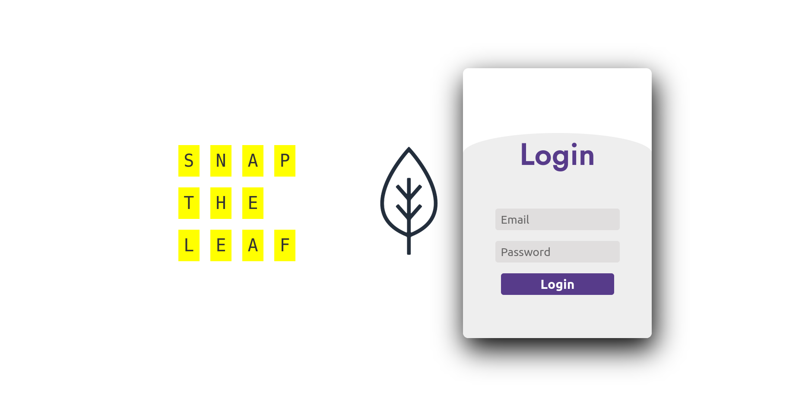

# Snap_the_leaf : Let AI figure out your plant's problem
Software Engineering Course Project : Snap the leaf   

# Motivation 
This app will let the users diagnose the disease of plants just by uploading the image of an infected leaf. A deep learning model will run the backend of this web app, which will perform the prediction task. This app will be helpful to both professional farmers and amateur horticulturists alike in diagnosing plant disease

# Features
-Predict the disease of the plant just by uploading the picture of leaf.

-Choosing 4 different predictors 

-Showing the probability that the AI think the disease the infected plant belongs to 

-If the user thinks that the prediction is not correct, he can forward it for an expert’s decision. 

-Showing the disease’s cure 

# Technical Specifications

## Dataset 
There are four Deep learning models in the backend which will do the actual prediction task. The models were trained on the publicly available “plant village dataset”. 

Plant village Dataset link : https://www.crowdai.org/challenges/plantvillage-disease-classification-challenge

## Technologies
This web app uses Flask in Back End. As Database, MySQL has been used.

Back End :  

Database :  

Screenshot: 

